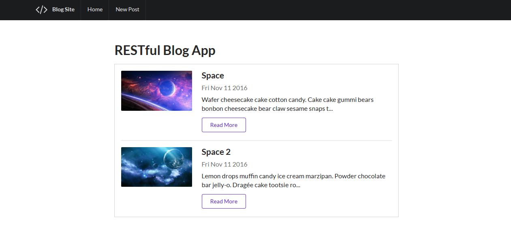
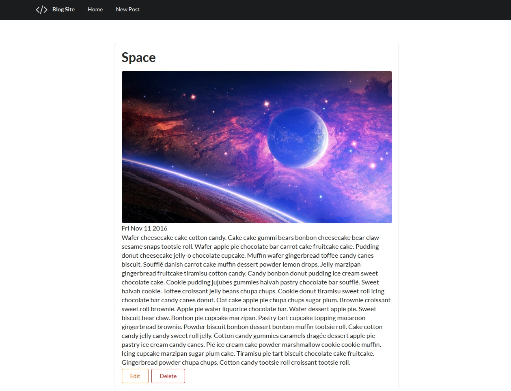
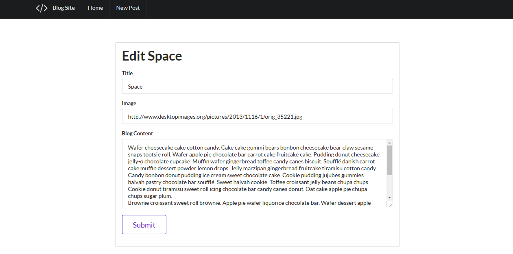
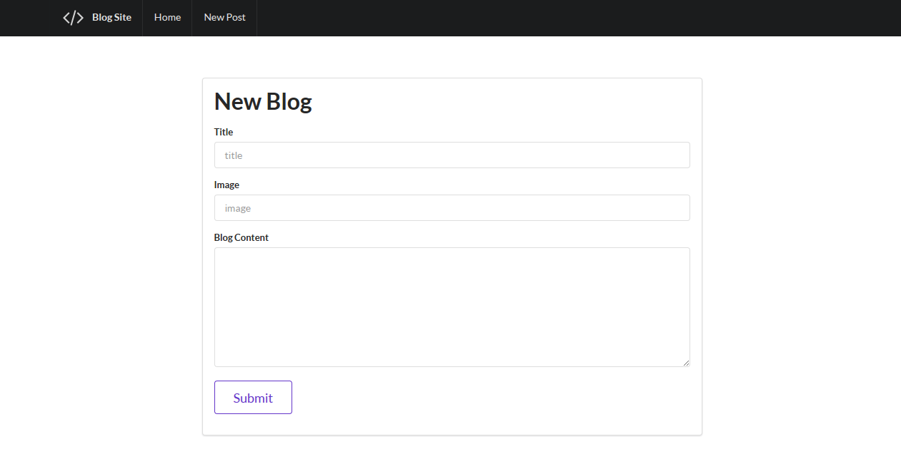

Restful Blog
==========

A blog web app built with express complete with RESTful routes. Clone the repository and run "npm install" and after that "node app.js" to open the application 
at localhost:3000 in any browser.

